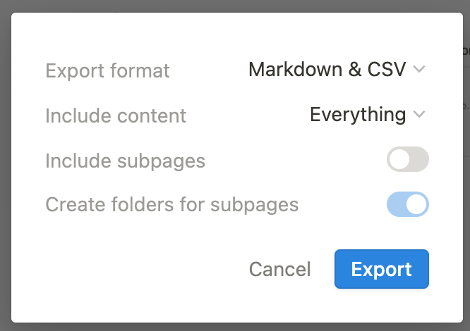

# Learn to publish your Notion Pages to your website with Zero-Code

<aside>
💡 Less Engineering → Faster product validation → Fast iterations

</aside>

In this tutorial, we will see how to quickly link all your static content stored in Notion pages to quickly sync to your website. 

## Step 1:

Start a Github Page following github’s official documentation: 

[Quickstart for GitHub Pages - GitHub Docs](https://docs.github.com/en/pages/quickstart)

## Step 2:

Clone this initialized github repository by opening the project on github and click on “Code” and copy the URL


[](../blog1/assets/gitclone.png)

Now open VSCode and Press Command + Shift + P and type git Clone now paste the link copied from part 1 of Step 2 as shown below:


## Step 3:

You will see this directory structure after cloned:

```c
./README.md
```

Now create a new folder say “Blog”. Your new directory structure should look like this:

```c
./README.md
./Blog
```

Now to this blog folder, we will be adding our Notion pages and then linking them to our main file, i.e., README.md.

## Step 4:

Pick a notion page such as shown below and to the top-right click on the three dots and click on “Export”


Once you click on Export, a dialog box like this will appear:



Let the option be Markdown & CSV and click Export. Next, save this zipped file to the folder created in Step 3. Note that you will have to unzip (untar) this because Notion by default saves it as a .zip extension. After unzipping, your finally directory structure will look like this:

```c
./README.md
./Blog
	./File1.md
```

(Note that in the above file structure the indentation means that [File1.md](http://File1.md) is stored within the Blog Folder. 

## Final Step:

Open the [README.md](http://README.md) file on VSCode and type the text as shown below:


The square brackets are important because only then can you add a link. After the square brackets are closed, use “()” to enclose the Link. 

Finally, you can commit your code with the following commands:

```bash
git add blog
git add README.md
git commit -m "my first blog"
git push origin main
```

Note than in order to push the code you have to make sure that your github account in VSCode has rights of a Collaborator on this project. Otherwise git push command won’t work. Check out this blog to see how to add yourself as a Collaborator: 

[Inviting collaborators to a personal repository - GitHub Docs](https://docs.github.com/en/account-and-profile/setting-up-and-managing-your-personal-account-on-github/managing-access-to-your-personal-repositories/inviting-collaborators-to-a-personal-repository)